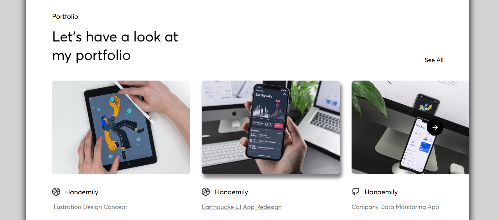
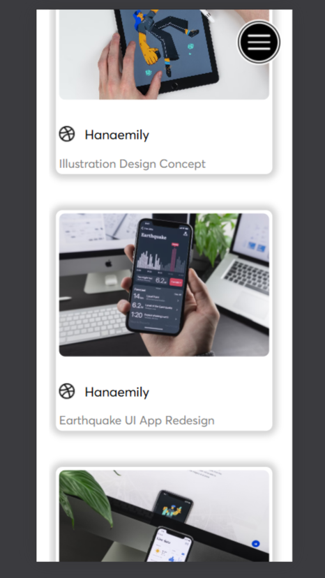
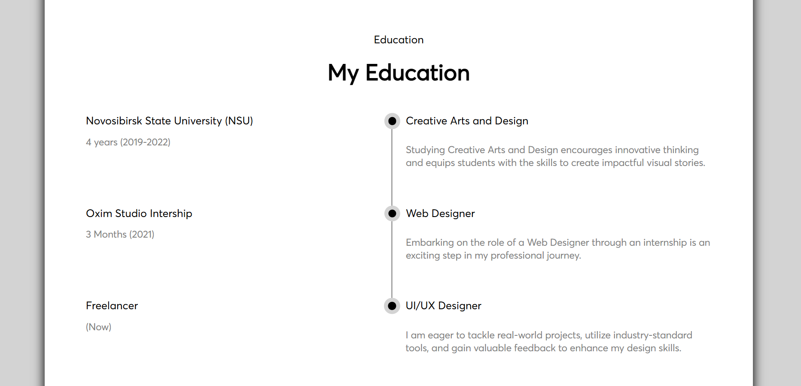
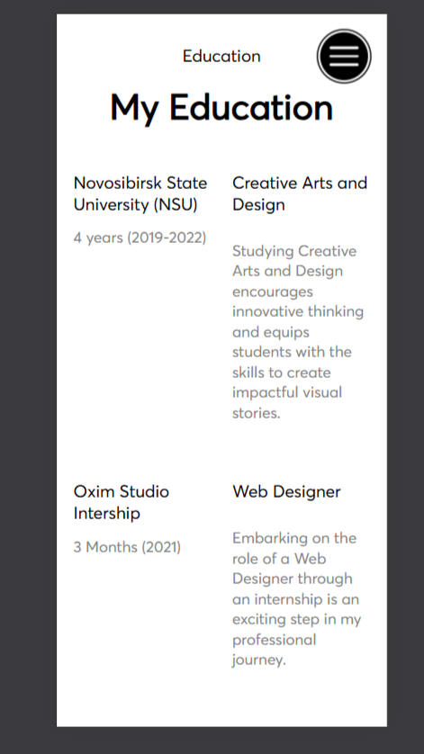
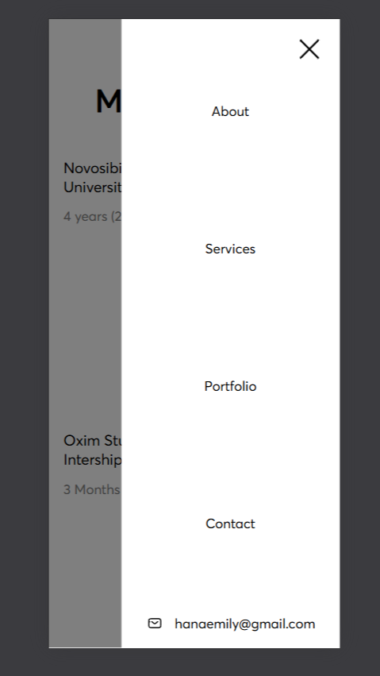

# Designer Interactive Web Page
## Description:
This is my first Web project! By creating this project, I wanted to consolidate my recently acquired knowledge of HTML and CSS, websites layout and their adaptation to different devices.

The following template was chosen for the website layout:

[Pixso UI Concept](https://pixso.net/community/file/sTd0A0IT3Gq47XDSPZSjvQ)

## Programming Tools:
* HTML 5.0
* CSS
* Basic JavaScript
* Visual Code (as IDE)

## Conceptual solution:
The site can be roughly divided into 3 visual elements:
* header
* main
* footer

In turn, "main" can be divided into the following sections:
* Designer Description
* Services Description
* Education
* Interactive Portfolio

## My Adaptations:

### Portfolio Section:

I adapted the portfolio section in the main section for phone screens: the horizontal scroll turns into a vertical "news feed".

#### How it was:

#### What it became:

### Education Section:

If the device screen is narrow enough, then this section loses its main visual element.

#### How it was:

#### What it became:

### Header

Header changes its appearance when the phone is oriented horizontally. Now it is not visible when the page loads. It opens when you click the button in the top right corner of the screen.
Along with the header, a translucent overlay appears. The header can be closed either by clicking on the cross button or by clicking on the overlay.

## Thanks for checking my first Web project!